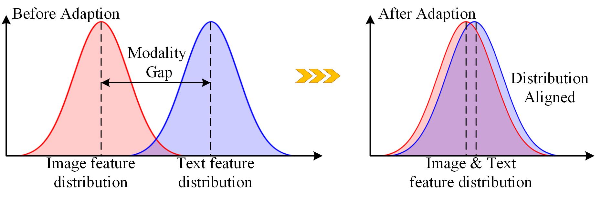
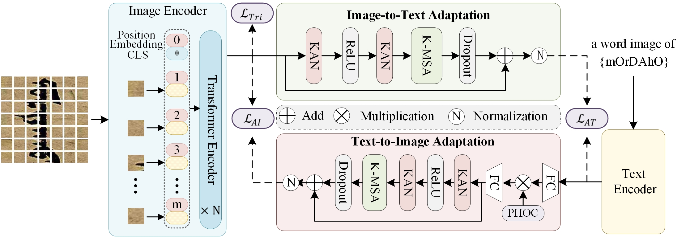
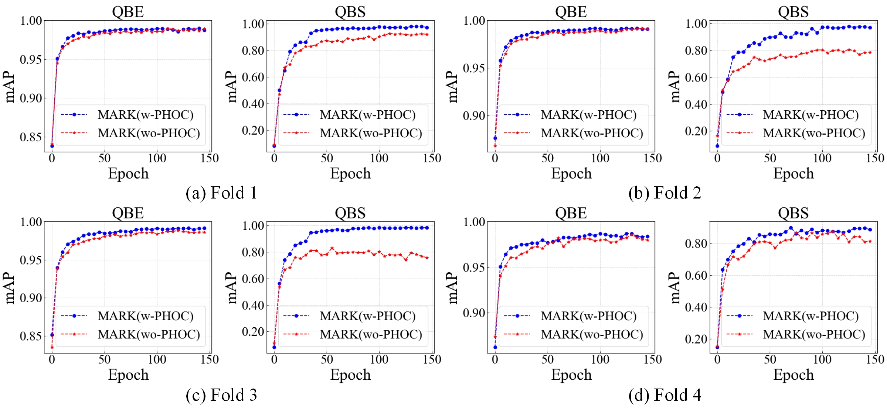
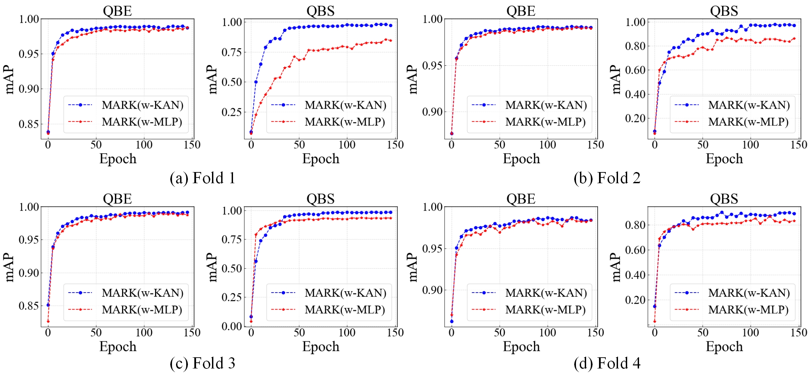

# :zap: MARK
Modality Adaptation Representation Learning for Historical Document Image Retrieval


## 💡 Abstract

<p align="center">
    
</p>
Word spotting is a fundamental task in Historical Document Image Retrieval (HDIR), categorized into query-by-example (QBE) and query-by-string (QBS) based on the query modality. QBS word spotting, as a cross-modal retrieval task, poses a significant challenge due to the substantial modality gap between image and text representations. Existing methods typically embed both image and text features into a common space and directly constrain their alignment, overlooking the substantial distribution gaps between modalities. Moreover, out-of-vocabulary (OOV) words present an additional challenge, requiring the model to possess strong generalization capability. To address these challenges, we propose a novel bi-directional modality adaptation representation learning framework, termed MARK. Specifically, the model adopts CLIP as the backbone to extract image and text features, providing a strong baseline for cross-modal representations. A bi-directional modality adaptation mechanism based on the Kolmogorov-Arnold network (KAN) is designed to capture both shared and complementary information between image and text representations. Furthermore, Pyramid Histograms of Characters (PHOC) is introduced to enhance fine-grained text representation and overcome the limitations of CLIP's text encoder. Extensive experiments on benchmark datasets, including Kanjur and Geser, demonstrate that MARK establishes a new state-of-the-art in HDIR. 

## 🤖 Architecture

<p align="center">
    
</p>

## 🔨 Installation
```bash
conda create -n diva python=3.9
conda activate mark
pip install -r requirements.txt
```

## 🦾 Regular Training 
This project provides two ways to run the program:

#### 1. Using Bash  
Run the following command in the terminal:  
```bash
# For Kanjur Dataset
bash ./run_shell/train_Kanjur.sh

# For Geser Dataset
bash ./run_shell/train_Geser.sh
```

#### 2. Using Python
Alternatively, you can run the program directly with Python:
```python
# For Kanjur Dataset
python train.py --exp_name Kanjur_f1 --data_dir /path/to/your/dataset_dir/ --data_split_dir /path/to/your/dataset/split_dir --batch_size 64 --data_split 3  --workers 32 --num_threads 1000 --clip_LN_lr 1e-6 --clip_name MetaCLIP

# For Geser Dataset
python train.py --exp_name Geser_0.2 --data_dir /path/to/your/dataset_dir/ --data_split_dir /path/to/your/dataset/split_dir --batch_size 64 --data_split 0.4  --workers 32 --input_dim 512  --num_threads 2000 --clip_LN_lr 1e-6 --clip_name MetaCLIP
```

#### ⚠️**Notes：**
The parameters in `bash ./run_shell/train_Geser.sh` and `python train.py` should be adjusted according to your actual file path and server environment configuration.


## 🌟 Main Results

### Comparative results of our MARK against existing methods on the Kanjur Dataset

| Method                   | Query | F1    | F2    | F3    | F4    | Avg   |
|--------------------------|-------|-------|-------|-------|-------|-------|
| BoVW [1]                 | **QBE** | 40.40 | 51.43 | 42.25 | 43.62 | 44.43 |
| AVWE [2]                 |       | 59.57 | 66.83 | 60.76 | 58.63 | 61.45 |
| RNN [3]                  |       | 54.54 | 62.05 | 53.30 | 60.82 | 57.68 |
| AVWE-SC [4]              |       | 63.25 | 65.06 | 63.99 | 64.71 | 64.25 |
| AVWE+RNN [5]             |       | 75.05 | 79.43 | 75.39 | 75.83 | 76.43 |
| Seq2seq (F2H1) [6]       |       | 80.16 | 85.08 | 79.08 | 84.59 | 82.23 |
| CNN (FC1) [7]           |       | 84.48 | 85.98 | 80.03 | 83.27 | 83.44 |
| Seq2seq+CNN [7]         |       | 88.02 | 90.35 | 84.62 | 87.21 | 87.55 |
| PUNet [8]               |       | 95.57 | 95.02 | 95.63 | 93.19 | 94.85 |
| EENet [9]            |       | 96.63 | 96.53 | 96.89 | 95.58 | 96.41 |
| HENet [9]            |       | 96.70 | 96.63 | 96.92 | 95.62 | 96.47 |
| CLIP* [10]             |       | 97.99 | 98.52 | 98.36 | 97.99 | 98.21 |
| MetaCLIP* [11]     |       | 98.90 | 99.17 | 99.20 | 98.76 | 99.01 |
| **MARK (Ours)**          |       | **99.10** | **99.40** | **99.27** | **98.89** | **99.16** |
|                          |       |        |        |        |        |        |
| PUNet [14]               | **QBS** | 88.46 | 85.67 | 91.77 | 90.11 | 89.00 |
| EENet [HENet]            |       | 88.90 | 94.93 | 92.61 | 92.39 | 92.21 |
| HENet [HENet]            |       | 89.19 | 95.13 | 93.21 | 92.51 | 92.51 |
| CLIP* [clip]             |       | 70.62 | 71.17 | 79.32 | 84.82 | 76.48 |
| MetaCLIP* [metaclip]     |       | 77.73 | 75.50 | 86.06 | 77.89 | 79.30 |
| **MARK (Ours)**          |       | **98.58** | **98.01** | **98.71** | **94.27** | **97.39** |

> \* Indicates our reproduction, training on the Kanjur dataset.

### Comparative results of our MARK against existing methods on the Geser Dataset

| Method                   | 20% (QBE) | 20% (QBS) | 40% (QBE) | 40% (QBS) | 60% (QBE) | 60% (QBS) | 80% (QBE) | 80% (QBS) |
|--------------------------|-----------|-----------|-----------|-----------|-----------|-----------|-----------|-----------|
| PUNet [14]               | 70.85      | 57.42      | 84.33      | 70.37      | 86.53      | 71.57      | 89.42      | 82.96      |
| EENet [9]            | 73.35      | 58.65      | 86.13      | 72.07      | 88.57      | 74.16      | 93.91      | 91.38      |
| HENet [9]            | 73.45      | 59.38      | 86.24      | 73.01      | 88.67      | 74.75      | 94.18      | 92.83      |
| CLIP* [10]             | 82.03      | 42.21      | 89.95      | 65.99      | 90.98      | 71.66      | 94.70      | 83.28      |
| MetaCLIP* [11]     | 82.85      | 79.62      | 90.33      | 84.54      | 91.74      | 85.96      | 94.32      | 91.10      |
| **MARK (Ours)**          | **85.19**  | **81.87**  | **91.59**  | **86.84**  | **92.64**  | **88.17**  | **95.65**  | **93.18**  |

> \* Indicates our reproduction, training on the Geser dataset.

### Ablation study on PHOC for Kanjur dataset across four folds.
<p align="center">
    
</p>

###  Comparison between KAN and MLP on the Kanjur dataset cross four folds.
<p align="center">
    
</p>

## 💙 Acknowledgement
MARK is built upon the awesome [CLIP](https://github.com/openai/CLIP), [MetaCLIP](https://github.com/facebookresearch/MetaCLIP), [FastKAN](https://github.com/ZiyaoLi/fast-kan). 
